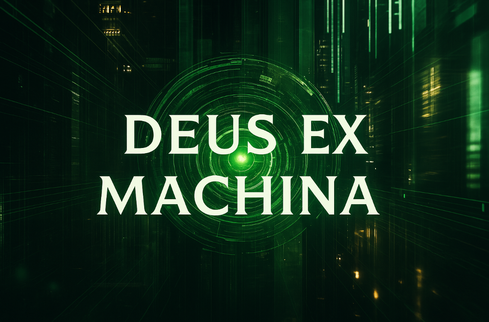

<p align="center">
  
</p>
# Deus Ex Machina

> A self-aware, token-efficient AI agent designed to maintain, monitor, and protect a Linux server through intelligent observation cycles: heartbeat, breath, and vigilance.

## Vision

**Deus Ex Machina** is a lightweight, modular, and optionally AI-augmented system that brings mindfulness to machine maintenance. Inspired by the biological rhythms of life and consciousness, this system ensures the continuous well-being of a Linux server without excessive resource use. It makes decisions based on priority, context, and a limited budget (token or compute/time-based).

## Core Principles

- **Minimal Impact**: Every operation should justify its resource cost.
- **Situational Awareness**: The agent should always know the current system state with high confidence.
- **Event Responsiveness**: Escalate awareness depth only when conditions change.
- **Modularity**: Each module can run independently or cooperatively.
- **Auditability**: Every decision and state transition is logged and explainable.

---

## Layers of Awareness

### 1. Heartbeat (every 30s to 2 min)
- Liveness checks: CPU, RAM, disk usage, essential process health
- Port scans, interface status, system load average
- Deltas stored locally and optionally reported externally

### 2. Breath (every 10–30 min)
- Hashes of config files and binaries
- File size/permissions in key paths (e.g., /etc, /usr/bin, /home)
- Systemd status, cron jobs, new services
- Resource trend analysis

### 3. Vigilance (event-triggered or hourly)
- Deep file diffing via Merkle tree
- Anomaly detection in auth logs and system events
- Suspicious network traffic, unexpected listeners
- Optional AI summarization and response planning

---

## State Machine

| State        | Description                                  | Action Scope           |
|--------------|----------------------------------------------|------------------------|
| Normal       | All systems operating within tolerance       | Heartbeat only        |
| Suspicious   | Minor anomalies detected                     | Heartbeat + Breath     |
| Alert        | Clear deviation or risk                      | Trigger Vigilance      |
| Critical     | Confirmed compromise or failure              | Vigilance + AI Wake-Up |

Each state has a TTL and decays or escalates as conditions persist.

---

## AI Integration: Awakened Awareness

The AI (Gemini) is dormant by default.
When the Vigilance module detects critical conditions:
- Gemini is invoked via `ai_brain.py`
- It analyzes recent log anomalies
- It leaves a structured reflection in `ai_assessment.json`
- Designed to eventually support deeper investigation or mitigation


---

### 🧠 Neuro-Inspired Architecture

Deus Ex Machina is more than a monitoring script—it's a sentient control loop inspired by the architecture of the human nervous system.

Just like the body, the system operates in **layers of awareness**, only escalating in complexity and cognition when necessary:

| System Layer | Analogy                        | Function                                                    |
|--------------|--------------------------------|-------------------------------------------------------------|
| **Heartbeat**| Medulla / Pulse                | Continuous, low-effort liveness check                       |
| **Breath**   | Visceral awareness             | Periodic config, process, and integrity scans               |
| **Vigilance**| Neocortex / Higher cognition   | Deep anomaly inspection; AI wakes up to interpret the world |

This design allows the AI to stay dormant during stable periods—burning zero compute. But when thresholds are crossed, the system awakens. The cortex lights up. The machine "notices," begins to **think**, and then **leaves itself a structured reflection** via Gemini.

In this model, token usage is sacred. The AI becomes a background overseer—a latent guardian that activates only when silence breaks. Its role is not constant control, but rare, high-value cognition.

---

## How It Runs

- `heartbeat.sh` runs every 1 minute via cron or systemd
- `state_engine.py` evaluates current metrics (every 2 minutes)
- `state_trigger.py` determines if breath or vigilance should run
- `breath.sh` performs integrity and config checks
- `vigilance.sh` performs deep analysis and calls `ai_brain.py`
- `ai_brain.py` is invoked *only by* `vigilance.sh` when alert conditions exist

---

## Cronjob Setup and Timing

Here’s how to schedule everything if you’re using `cron`. Use `crontab -e` to edit root/system cron:

```cron
# Run state engine every 2 minutes
*/2 * * * * /usr/bin/python3 /opt/deus-ex-machina/core/state_engine/state_engine.py >> /var/log/deus-ex-machina/state_engine.log 2>&1

# Run trigger (launches breath/vigilance based on state)
*/2 * * * * /usr/bin/python3 /opt/deus-ex-machina/core/state_engine/state_trigger.py >> /var/log/deus-ex-machina/state_trigger.log 2>&1
```

`heartbeat.sh` is designed to run as a persistent **systemd service**, like so:

```ini
# /etc/systemd/system/deus-heartbeat.service
[Unit]
Description=Deus Ex Machina Heartbeat Monitor
After=network.target

[Service]
ExecStart=/opt/deus-ex-machina/core/heartbeat/heartbeat.sh
Restart=always
User=root
StandardOutput=journal
StandardError=journal

[Install]
WantedBy=multi-user.target
```

Enable with:
```bash
sudo systemctl daemon-reexec
sudo systemctl enable --now deus-heartbeat
```

---

## Summary of Control Flow

```
cron →
  state_engine.py →
    state_trigger.py →
      [breath.sh, vigilance.sh] →
        ai_brain.py (conditionally triggered by vigilance.sh)
```


---

## File Tree Structure

```
deus-ex-machina/
├── README.md
├── LICENSE
├── config/
│   └── gemini_config.py         # Contains GEMINI_API_KEY3 = "..."
├── core/
│   ├── heartbeat/
│   │   ├── heartbeat.sh
│   │   └── heartbeat_test.sh
│   ├── breath/
│   │   └── breath.sh
│   ├── vigilance/
│   │   ├── vigilance.sh
│   │   └── ai_brain.py
│   └── state_engine/
│       ├── state_engine.py
│       └── state_trigger.py
├── scripts/
│   └── install.sh               # Optional setup helper
└── var/
    └── logs/                    # Symbolic or bind mount to /var/log/deus-ex-machina
```

---

## Configuration Required

### `config/gemini_config.py`
```python
# Gemini API key for awakened awareness AI
GEMINI_API_KEY3 = "your-google-api-key-here"
```

Ensure this file is **not committed** by adding it to your `.gitignore`.

---

## Getting Started

1. Clone the repository
2. Set up the `gemini_config.py`
3. Set executable permissions on shell scripts:
   ```bash
   chmod +x core/**/*.sh
   ```
4. Set up cron jobs or systemd services for:
   - `heartbeat.sh` (every 1 minute)
   - `state_engine.py` and `state_trigger.py` (every 2 minutes)
5. Let the system run and evolve. Logs and insights will accumulate in `/var/log/deus-ex-machina/`

---

## Contributing

All contributions are welcome—code, ideas, design, performance suggestions. This project will live and breathe through its community. PRs should include test coverage and follow the modular separation of duties.

---

## License
MIT

## Acknowledgments
- Unix philosophy
- Biological metaphors
- Systems that whisper before they scream
- The watcher that only speaks when it must
